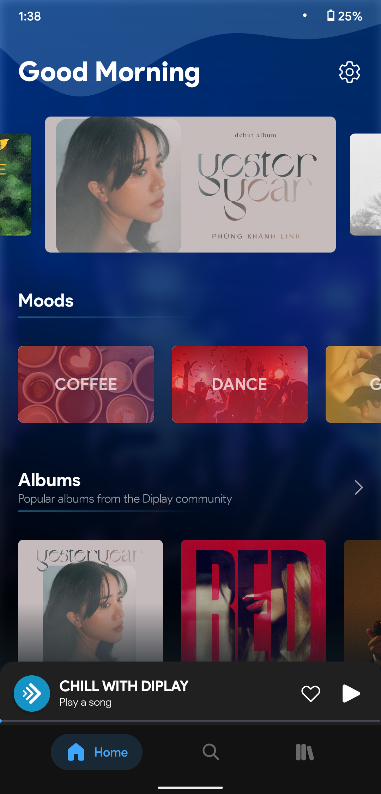
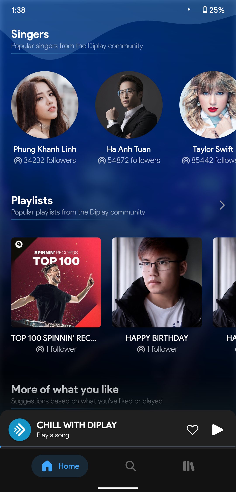
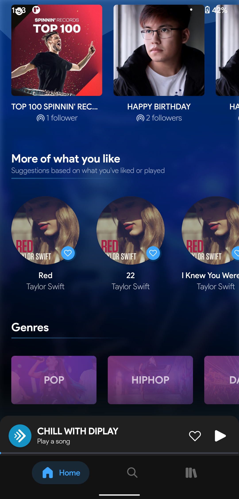
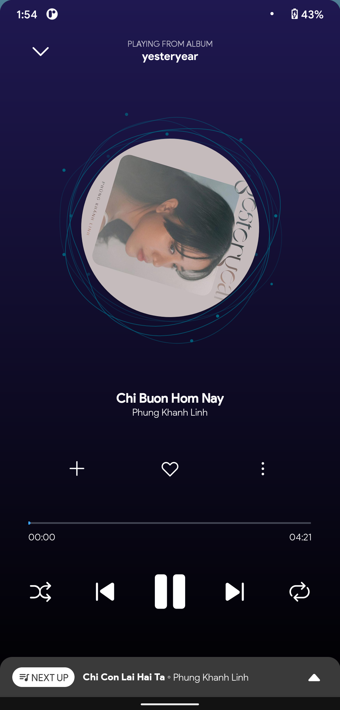
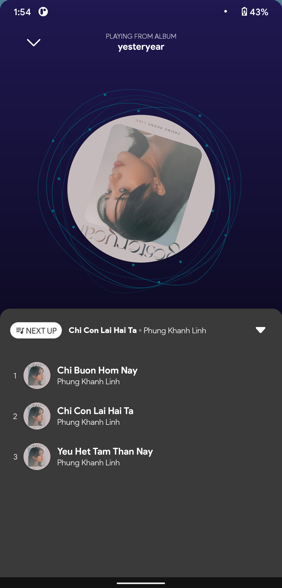
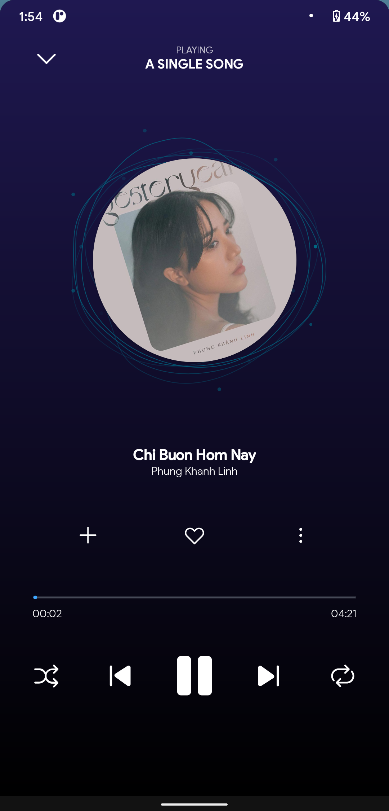
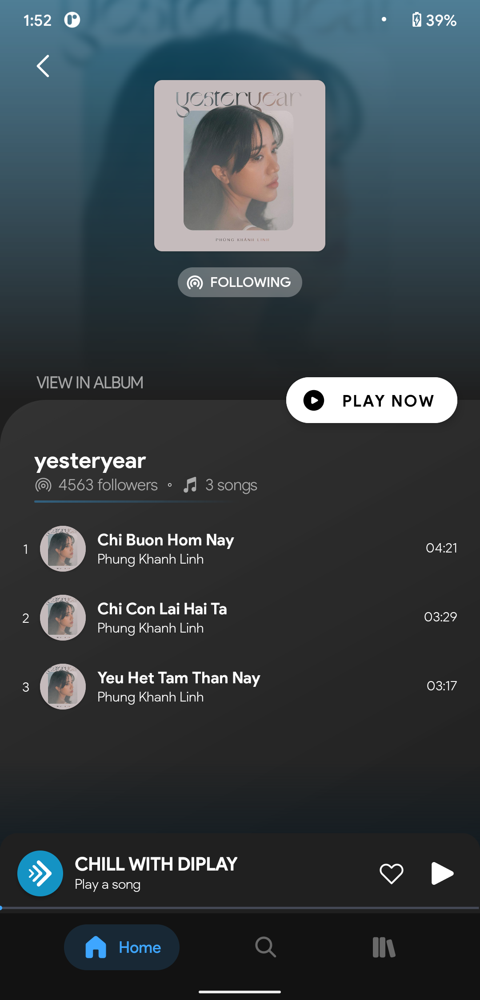

<!-- PROJECT LOGO -->
 

  

  <h3 align="center">JAVA PROJECT</h3>

  

    MUSIC APPLICATION - DIPLAY
  

<!-- ABOUT THE PROJECT -->

## About The Project

  Приложение для музыкального плеера - один из mp3-плееров для Android. Музыка, аудиофайлы воспроизводятся гладко. Это красиво и бесплатно.
Приложение поддерживает музыкальные форматы: MP3
Приложение было организовано, чтобы легче слушать музыку, «Музыкальный проигрыватель» быстро просматривает всю музыку на вашем мобильном телефоне.

### Functions 

Особенности бесплатного музыкального проигрывателя - mp3-плеер:
-	Обнаруживать все музыкальные файлы на Android-телефоне.
-	Offline музыкальный проигрыватель, плейер, аудиоплеер, мощный mp3-плеер с высоким качеством.
-	В меню есть много элементов, таких как: альбом, исполнитель, жанр, песня, плейлист, исполнитель, каталог и альбом.
-	Хорошо работайте с гарнитурой или наушниками. Все кнопки на гарнитуре поддерживались. Не прикасайтесь к устройству.
-	Музыкальная библиотека. Будет показана вся аудио-музыка, песни в библиотеке.
-	Функция поиска. Поиск по названию (название песни), альбом, исполнитель, плейлист.
-	Плейлист. Пользователи могут добавлять новый плейлист, редактировать или удалять старый плейлист. Добавьте песню в список воспроизведения. Имеет последние плейлисты.
-	Управление Bluetooth. Совместимость с наушниками или гарнитурой Bluetooth. Поддержка всех элементов управления, таких как перемотка назад, далее, пауза, остановка, воспроизведение
-	Поддержка mp3-файла. Mp3 - самый популярный музыкальный формат. Таким образом, мы также называем mp3-плеер или аудиоплеер.
-	Покажите фотографию песни, исполнителя и обложки альбома.
-	Музыкальный онлайн-плеер с регулярно обновляемыми песнями.
-	Создавайте аккаунты быстро и удобно для пользователей.

### Languages used

- JAVA
- XML

## Recommendations and supports

-	Theme: Dark theme
-	Android version: Newer than or equal to Andorid 8.0 (API level 26)
-	Language: English, Russian, Vietnam.

### Demo screenshots

   
  
   

   
  
   

   
  
   

   
  
   

   
  
   

   
  
   

   
  
   

   
  
   

 

<!-- CONTACT -->

## Author

-	Author: Le Dinh Cuong (Ле Динь Кыонг)
-	Email: dinhcuong.firewin99@gmail.com
-	Github: [github@ledhcg](https://github.com/ledhcg)
-	Website: [dinhcuong.me](https://dinhcuong.me)

<!-- ACKNOWLEDGEMENTS -->

## Acknowledgements

- [000webhost](https://www.000webhost.com)
